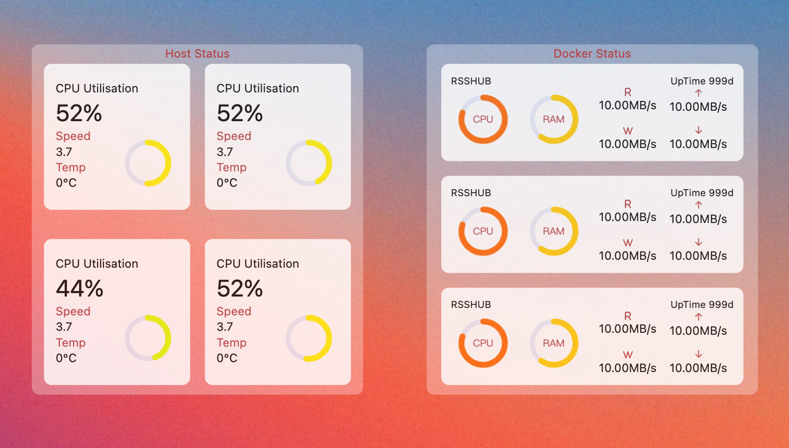

<div align="center">
<h1 align="center"><a href="https://github.com/yaotutu/server-lite-monitor"> Server Lite Monitor
</a></h1>

一个轻量级的系统监控面板,专为移动端开发, 可以用来监控你的NAS,Linux服务器,OpenWrt等.当然,你也可以用来监控你的windows或者Mac OS.



</div>

> ⚠️ warning!!!
> 本项目处于非常早期的阶段,正在火力全开更新阶段,UI部分暂时不会有大的调整,后端接口正处于不停地变更中.

## 工作方式
* 监控宿主机
  * 即安装在哪台设备,即可监控当前设备的运行状态.比如通过docker安装在unriad,群晖,QNAP,等支持docker容器的设备上,即可监控该设备的状态.
* 监控其他设备(开发中...)
  * 将该项目进行部署,然后通过ssh或者其他方式监控别的设备
  * 比如,将该项目部署在nas中,监控自己的OpenWrt路由器.
## 安装
docker部署或者通过node部署. 

部署后访问 http://ip:3000/systeminfo

### docker 部署

``` shell
docker run -d \
  -p 3000:3000 \
  --name server-lite-monitor \
  july1995/server-lite-monitor

```

### docker compose部署
下载项目的 docker-compose.yaml

执行命令
``` shell
docker-compose up -d
```

### 本地部署
* 要求nodejs 20 与 pnpm
* 部署后访问 http://ip:3000/systeminfo

``` shell 
pnpm install 
pnpm build
pnpm start
```

### 本地调试与开发
* 要求nodejs 20 与 pnpm
* 部署后访问 http://ip:3000/systeminfo

``` shell 
pnpm install 
pnpm dev
```


# TODO


## License

[MIT](./LICENSE) @yaotutu